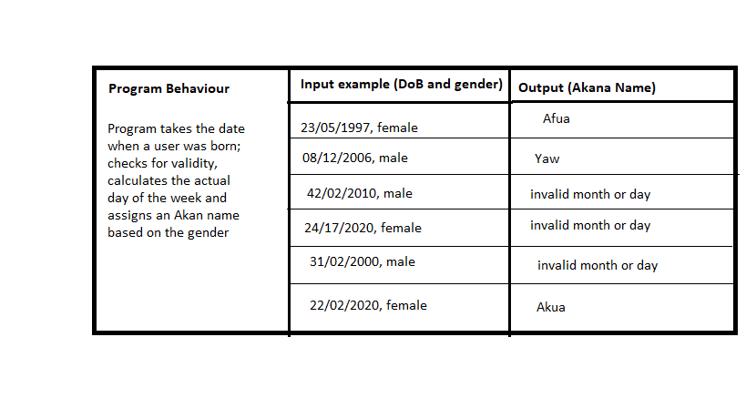

# Akan Names Generator
#### An application that gets your date of birth and gender, does some calculation to get your day of birth which it then uses to asign you an Akan name based on your gender, {22/03/2023}
#### By **{Jackline Makena}**
## Description
This is a web application where you select the date of your birth and gender. Once you submit, the application uses a  formula to get the actual day you were born i.e Day of the week (d) = ( ( (CC/4) -2*CC-1) + ((5*YY/4) ) + ((26*(MM+1)/10)) + DD ) mod 7 ; where CC is the century digits, YY is the year digits, MM is the month and DD is the day of the month. Based on the day from the calculation above it checks your gender and assigns you an Akan name from the Ghanaian naming system. If Male; Sunday: Kwasi, Monday: Kwadwo,Tuesday: Kwabena, Wednesday: Kwaku, Thursday:  Yaw, Friday: Kofi,Saturday: Kwame. If Female;Sunday: Akosua, Monday: Adwoa, Tuesday: Abenaa, Wednesday: Akua, Thursday:  Yaa, Friday: Afua, Saturday: Ama. 
## Setup/Installation Requirements
 All you need is an electronic device with a web browser such as chrome, opera mini, explorer, firefox or safari installed and a stable  internet connectivity. 

The URL is https://github.com/JacklineMM/Akan-Name-Generator

## BDD
 
## Technologies Used
The technologies used were
 HTML
 CSS 
 JAVASCRIPT
## Support and contact details
I am always willing to improve on challenges so for questions, feedback and ideas feel free to reach  me at jacquemackena@gmail.com.
### License
*Copyright 

Permission is hereby granted, free of charge, to any person obtaining a copy of this software and associated documentation files (the “Software”), to deal in the Software without restriction, including without limitation the rights to use, copy, modify, merge, publish, distribute, sublicense, and/or sell copies of the Software, and to permit persons to whom the Software is furnished to do so, subject to the following conditions:

The above copyright notice and this permission notice shall be included in all copies or substantial portions of the Software.

THE SOFTWARE IS PROVIDED “AS IS”, WITHOUT WARRANTY OF ANY KIND, EXPRESS OR IMPLIED, INCLUDING BUT NOT LIMITED TO THE WARRANTIES OF MERCHANTABILITY, FITNESS FOR A PARTICULAR PURPOSE AND NONINFRINGEMENT. IN NO EVENT SHALL THE AUTHORS OR COPYRIGHT HOLDERS BE LIABLE FOR ANY CLAIM, DAMAGES OR OTHER LIABILITY, WHETHER IN AN ACTION OF CONTRACT, TORT OR OTHERWISE, ARISING FROM, OUT OF OR IN CONNECTION WITH THE SOFTWARE OR THE USE OR OTHER DEALINGS IN THE SOFTWARE.

*
